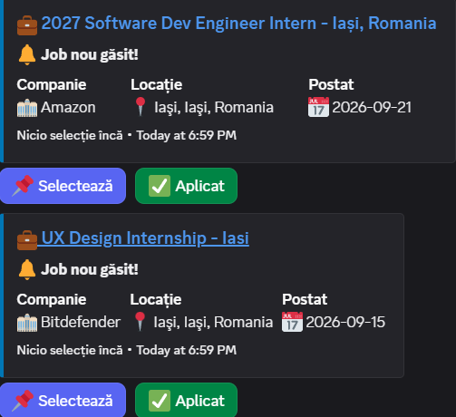

# Jobby - LinkedIn IT Job Notifier Discord Bot

**Jobby** is a simple and efficient Discord bot specialized in the **IT / Software Engineering** field. It automatically searches for job openings on **LinkedIn**, sends real-time notifications when new IT jobs appear, and lets users interact with jobs directly from Discord through **interactive buttons** (Select & Applied).

## Demo

Job alerts posted in Discord as interactive cards:

<p align="center">
  
</p>

## Key features

- **IT-only filtering**: The bot automatically applies special job-function filters and technology keywords (`f_F=it` + IT title filter) to remove jobs from other fields (HR, sales, drivers, etc.) and show only IT/Software jobs.
- **Simple search**: Run a single command `!search <keywords> <location>` (or `/search`) to quickly find IT openings on LinkedIn.
- **Automatic notifications (Auto-Update)**: The bot saves your search and periodically checks in the background (every 15 minutes) for new IT jobs. When it finds a new opening, it automatically posts a card (embed) in the channel.
- **Interactive Discord buttons**:
  - **Select**: Mark a job as selected/saved. Your name appears in the footer of the Discord card.
  - **Applied**: Mark a job as applied, so colleagues/friends in the server know which jobs have already been applied to.
- **Integrated SQLite database**: Remembers jobs that were already notified (to avoid duplicates) and persists the state of selections and active searches even after the bot restarts.
- **No LinkedIn authentication**: Scrapes the public guest endpoint, removing the risk of getting your personal LinkedIn account blocked.

## Requirements and installation

### 1. Clone the project & install dependencies
Make sure you have **Python 3.8+** installed. Run in the terminal:

```bash
git clone https://github.com/username/jobby.git
cd jobby
python -m pip install -r requirements.txt
```

### 2. Environment configuration (`.env`)
Create a file named `.env` in the project root and add your Discord bot token:

```env
DISCORD_TOKEN=your_discord_bot_token_here
```

> *Note*: Make sure the bot has the `Message Content Intent` and `Server Members Intent` permissions enabled in the Discord Developer Portal.

### 3. Start the bot
Run the command:

```bash
python main.py
```

## Usage in Discord

### Search for IT jobs and enable notifications:
Run in any channel of your Discord server:

```text
!search "Python Developer" "Romania"
```
or
```text
!search "Junior" "Remote"
```

1. The bot will immediately display the latest IT jobs found on LinkedIn as clean cards.
2. The bot automatically registers the channel for background IT job checks every 15 minutes.
3. Press the **Select** or **Applied** buttons under any job to mark its state in the conversation.

## Running 24/7 with Docker

To keep the bot running continuously (24/7), the simplest option is to start it with Docker. The SQLite database (`jobs.db`) is stored on a Docker volume, so the state (seen jobs, selections, active searches) **is preserved across restarts**.

> **Note on "24/7"**: The bot runs as long as the host machine (and Docker) are on. If you run it on your laptop, the bot stops when you close the laptop. For real 24/7 uptime, move the same setup to an always-on server (VPS). The configuration below works identically in both cases.

### 1. Requirements
- [Docker](https://docs.docker.com/get-docker/) and Docker Compose installed.

### 2. Token configuration
Copy the example file and fill in your Discord token:

```bash
cp .env.example .env
# edit .env and set DISCORD_TOKEN=...
```

> The `.env` file is in `.gitignore` — never publish your token.

### 3. Start
```bash
docker compose up -d --build
```

The bot starts in the background and will restart automatically (`restart: unless-stopped`) if it crashes or if you reboot the machine.

### 4. Useful commands
```bash
docker compose logs -f      # follow logs in real time
docker compose restart      # restart the bot
docker compose down         # stop the bot (data in the volume is preserved)
docker compose up -d --build   # rebuild after code changes
```

The database persists in the Docker volume named `jobby-data`. Even if you delete and rebuild the container, the data remains. (To fully delete the data: `docker compose down -v`.)

## Project structure

```text
jobby/
├── main.py           # Discord bot logic, command handlers, UI View & background task
├── scraper.py        # Web scraping & IT-only filtering for the public LinkedIn endpoint
├── database.py       # SQLite interface (jobs.db) for deduplication and user selections
├── requirements.txt   # Python dependencies (discord.py, beautifulsoup4, requests, python-dotenv)
├── Dockerfile         # Docker image for containerized execution
├── docker-compose.yml # Orchestration + persistent volume for jobs.db + automatic restart
├── .env.example       # Template for environment variables (DISCORD_TOKEN)
├── .dockerignore      # Files excluded from the Docker image
└── README.md         # Project documentation
```

## License
Project created for educational purposes. Use in accordance with the terms and conditions of the platforms involved.
